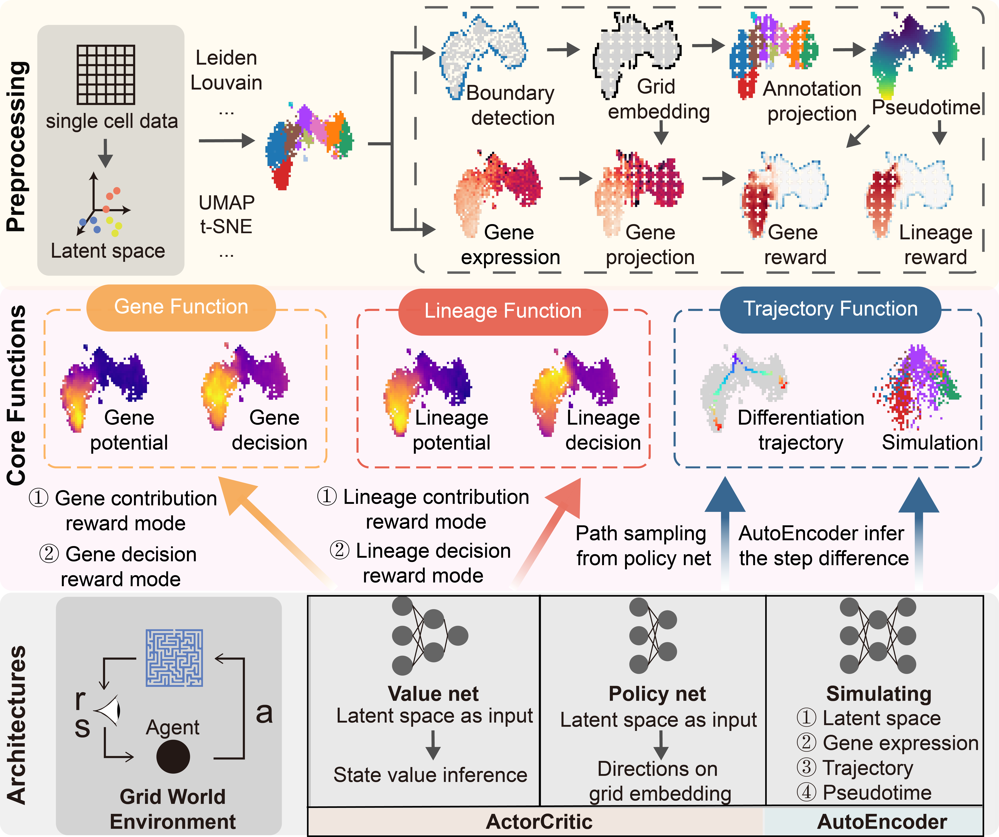

scRL: deep reinforcement learning in single cell data analysis for fate decision evaluation
============================================================================================

Single-cell sequencing effectively delineates the heterogeneous states within cell populations, and pseudotime analysis reconstructs these states' sequential transitions. However, pseudotime often fails to adequately represent intermediate states where critical cell fate decisions are made. To overcome this limitation, we introduce single-cell Reinforcement Learning (scRL), which integrates single-cell grid embedding—an extension of UMAP—with a robust reinforcement learning framework using an actor-critic architecture. This novel approach dynamically simulates differentiation pathways, enhancing our understanding of cell fate decision timing and progression. Using lineage or genetic information-based rewards, the actor network samples potential differentiation trajectories, while the critic network assesses the decision strength. Our results reveal that the strength of fate decisions typically peaks before lineage potential and gene decision strength precedes gene expression, identifying key transitional phases and pre-expression states. Validated through an irradiation-perturbed atlas and a gene perturbation atlas of hematopoietic lineages, scRL offers a nuanced understanding of cellular differentiation, improving our ability to decode and predict cell fate decisions and developmental outcomes.

Model Architecture and Reinforcement Learning Environment
------------------------------------------------------------

The scRL model architecture is grounded in the Actor-Critic reinforcement learning framework, which is specifically tailored for the unique environment created by single-cell data. This environment is meticulously constructed through a comprehensive data preprocessing pipeline, providing a structured playground where the reinforcement learning agent can explore and learn effectively.

At the heart of scRL's model is its capability to transform high-dimensional single-cell data into a grid embedding. This embedding, generated using a boundary scanning algorithm, serves as a critical interface between the raw data and the reinforcement learning agent. It not only preserves the essential topological features of the original data but also facilitates efficient exploration and learning by the agent.

Within this environment, the reinforcement learning agent, guided by the Actor-Critic architecture, interacts with the grid embedding to gather information and make informed decisions. The agent receives rewards based on predefined criteria, such as gene expression patterns or lineage commitments, which are designed to encourage the learning of optimal policies for understanding cellular fate determination and differentiation.

Workflow Overview
------------------

1. **Data Preprocessing and Grid Embedding Generation**:

   - scRL begins by preprocessing the single-cell data, employing techniques like PCA, UMAP, t-SNE for dimensionality reduction, and clustering algorithms like Leiden or Louvain for subpopulation identification.
   - A specialized grid embedding is then created using a boundary scanning algorithm, mapping the single-cell data into a manageable 2D space while preserving crucial topological relationships.

2. **Projection and Pseudotime Calculation**:

   - Both subpopulation information and gene expression data are projected onto this grid embedding, providing a rich context for the reinforcement learning agent.
   - A starting subpopulation, often representing stem or progenitor cells, is selected, and the Dijkstra shortest path algorithm is employed to compute the pseudotime—a measure of cellular progression—from every grid point to this starting point.

3. **Environmental Reward Generation**:

   - Leveraging pseudotime information, scRL crafts environmental rewards that guide the reinforcement learning agent.
   - Lineage-specific rewards are designed based on target lineages' grid regions, while gene-specific rewards are formulated using projected gene expression data.
   - Two distinct reward patterns—contributory (increasing with pseudotime) and fate-determining (decreasing with pseudotime)—offer flexibility in exploring different cellular behaviors.

4. **Reinforcement Learning Training and Interaction**:

   - With a fully established environment and reward system, the Actor-Critic reinforcement learning architecture engages in interactive learning.
   - The agent explores the grid-embedded environment, making decisions based on policies learned through interactions and feedback from the environment.
   - The goal is to maximize cumulative rewards, indicating a deeper understanding of cellular fate determination and differentiation processes.

Functional Modules
-------------------

scRL's functionality extends beyond basic reinforcement learning, offering three specialized modules:

1. **Gene Functional Module**:

   - Explores gene expression patterns and potentials, providing insights into genes' roles in cellular differentiation and fate determination.
   - Outputs gene-specific valuations based on the chosen reward mode, shedding light on their contributory or fate-determining effects.

2. **Lineage Functional Module**:

   - Delves into lineage commitments and potentials, revealing the trajectories and decision-making processes involved in cellular differentiation.
   - Offers lineage-specific valuations, highlighting key lineages and their associated fate determination strengths.

3. **Trajectory Functional Module**:

   - Focuses on differentiation trajectories, sampling and visualizing the paths cells take during their developmental journey.
   - Utilizes an advanced autoencoder, trained in parallel with the Actor-Critic architecture, to simulate and predict future differentiation steps.
   - Provides a parameterized probability distribution for upcoming changes in cellular states, gene expressions, and trajectory coordinates, offering unparalleled insights into the dynamics of cellular differentiation.

Installation
------------

.. code-block:: python

    pip install singlecellRL

.. toctree::
   :maxdepth: 1
   :hidden:
   :caption: TUTORIALS

   notebook/Basics_on_scRL
   notebook/Application1
   notebook/Application2

.. toctree::
   :maxdepth: 2
   :hidden:
   :caption: API
   
   GridCore
   environment
   trainer
   simulator
   trajectory

